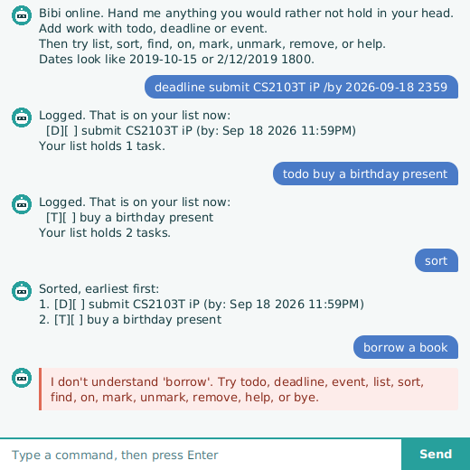

# Bibi User Guide

Bibi is a small filing robot for the things you would rather not hold in your head.
Tell it what needs doing, and it keeps the list — between sessions, without being asked.



## Getting started

1. Make sure you have **Java 25** installed.
2. Download `bibi.jar` from the [latest release](https://github.com/joshmode/ip/releases).
3. Put it in a folder of its own, then run it:

```
java -jar bibi.jar
```

Bibi saves your tasks to `data/bibi.txt` beside wherever you started it, so a fresh
folder gives you a fresh list.

> **Tip:** type in the box at the bottom and press <kbd>Enter</kbd>, or click **Send**.
> Everything is a short typed command — there is nothing to click through. 🤖

## Adding things to do

Bibi keeps three kinds of task.

| Kind | What it is | Command |
|------|------------|---------|
| ToDo | something with no particular date | `todo <description>` |
| Deadline | something due by a date | `deadline <description> /by <when>` |
| Event | something that runs from one time to another | `event <description> /from <start> /to <end>` |

For example:

```
todo buy a birthday present
deadline submit CS2103T iP /by 2026-09-18 2359
event tutorial /from 2026-09-15 1400 /to 2026-09-15 1500
```

Bibi confirms each one and tells you how long your list is:

```
Logged. That is on your list now:
  [D][ ] submit CS2103T iP (by: Sep 18 2026 11:59PM)
Your list holds 1 task.
```

### Writing dates

Dates are real dates, not free text, which is what lets Bibi sort them and search
them by day.

| Form | Example |
|------|---------|
| `yyyy-MM-dd` | `2026-09-18` |
| `d/M/yyyy` | `18/9/2026` |
| either, plus a 24-hour time | `18/9/2026 2359` |

A date without a time means the whole day. A date that does not exist — `2026-02-30`,
say — is refused rather than quietly shifted, and an event may not end before it starts.

## Seeing your list

```
list
```

Each task shows its kind and whether it is done:

```
1. [D][X] submit CS2103T iP (by: Sep 18 2026 11:59PM)
2. [T][ ] buy a birthday present
```

`[T]`, `[D]` and `[E]` are ToDo, deadline and event. `[X]` means done, `[ ]` means not yet.

## Putting the list in order

```
sort
```

Sorts everything with a date into chronological order, earliest first, and puts undated
ToDos at the end — a ToDo has no particular moment to be ready for.

The new order is **kept**, not just displayed. That matters because the numbers you type
into `mark`, `unmark` and `remove` come from the list, so an order that vanished when you
looked away would leave those numbers pointing at the wrong tasks.

## Finding things

```
find book
on 2026-09-18
```

- `find` searches descriptions and ignores case, so `find BOOK` finds "read book".
- `on` shows deadlines falling on a date, and events running across it.

Both keep each task's number **from the full list**, so you can act on a result straight
away without running `list` first.

## Marking things done, and removing them

```
mark 2
unmark 2
remove 2
```

Numbers come from the most recent listing. `mark` ticks a task off, `unmark` reopens it,
and `remove` takes it off the list for good.

## Help, and leaving

```
help
bye
```

`help` lists every command. `bye` closes Bibi — your tasks are already saved.

## When something goes wrong

Bibi tries to say what is actually wrong rather than just refusing. Mistakes are shown
in red so you can spot them when scrolling back:

- **An unknown command** names the word it could not place.
- **A missing part** shows the shape of the command, with an example.
- **A parameter used twice** — `deadline report /by Mon /by Tue` — says so, rather than
  complaining about an unreadable date.
- **A task you already have** is pointed at by number, and nothing is changed.
- **A damaged save file** is reported line by line; the lines Bibi *could* read are kept.

## Command summary

| Command | Does | Example |
|---------|------|---------|
| `todo` | adds an undated task | `todo buy a present` |
| `deadline` | adds a task due by a date | `deadline report /by 2026-09-18` |
| `event` | adds a task with a start and end | `event camp /from 2026-09-15 /to 2026-09-17` |
| `list` | shows everything | `list` |
| `sort` | orders by date, undated last | `sort` |
| `find` | searches descriptions | `find book` |
| `on` | shows what falls on a date | `on 2026-09-18` |
| `mark` | ticks a task off | `mark 2` |
| `unmark` | reopens a task | `unmark 2` |
| `remove` | deletes a task | `remove 2` |
| `help` | lists the commands | `help` |
| `bye` | closes Bibi | `bye` |

## Running without the window

Bibi also has a text-only interface, which is what its automated tests drive:

```
java -cp bibi.jar bibi.Bibi
```

Same chatbot, same save file — only the last step differs.
